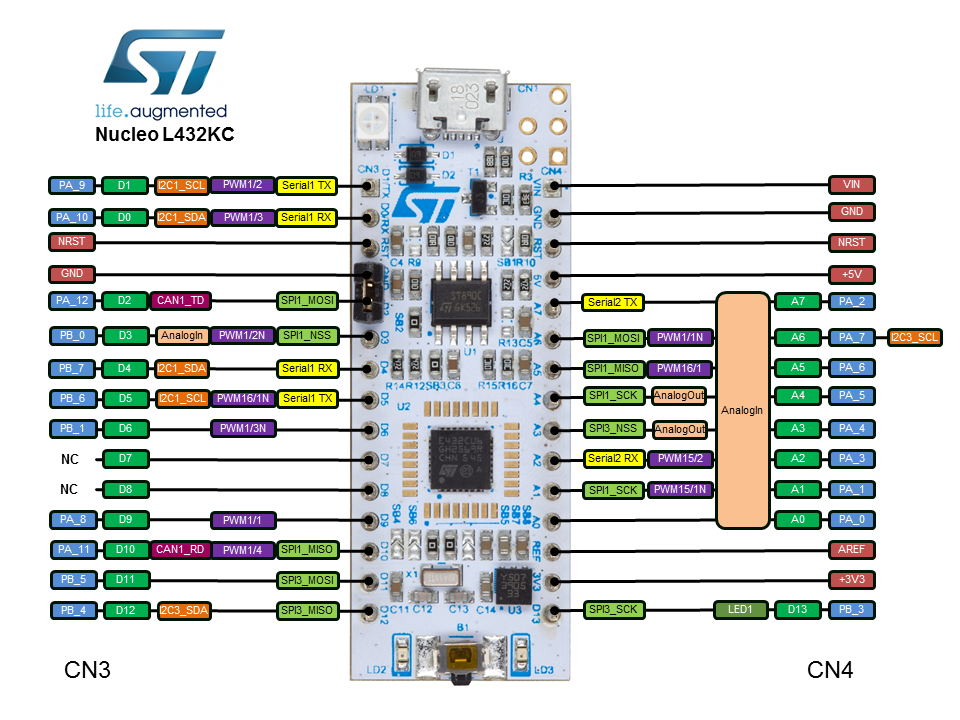

# rust-stm32l432kc
STM32L432KC board examples in rust

## Compilation and load

*prerequisites*
```console
rustup target add thumbv7em-none-eabihf
```

*build*
``` console
$ cargo build
$ cargo build --release
$ cargo build --target thumbv7em-none-eabihf --release  
```

*check*
```
$ arm-none-eabi-readelf -h <output>
$ arm-none-eabi-readelf -A <output>
$ cargo objdump --bin <output> -- -d -no-show-raw-insn
$ arm-none-eabi-size -tA <output>
```

*elf to bin/hex format*
``` console
$ arm-none-eabi-objcopy -O ihex <output> <output>.hex 
$ arm-none-eabi-objcopy -O binary <output> <output>.bin 
```

*load*
``` console
$ cp <output>.bin <device-path>
$ cp <output>.bin /run/media/luca/NODE_L432KC
```

*debug with openocd*
in one console:
``` console
$ openocd -f nucleo_l432kc.cfg
```

in another console:
``` console
$ arm-none-eabi-gdb -q -x openocd.gdb <output>
```

*read from serial interface via USB*
``` console
$ tail -f /dev/ttyACM1
$ screen /dev/ttyACM1 9600
```


